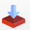
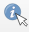
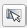
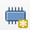
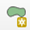
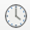

# Tutoriel - Importer un fichier GeoTIFF optimisé pour le cloud dans QGIS

[_auf Deutsch_](./README.md)

## Installation et utilisation de l'extension dans QGIS

1. **Installer l'extension**

https://github.com/user-attachments/assets/9ed8fa1c-de75-4205-99d8-9a9e186064c4

- Allez dans `Plugins` > `Manage and Install Plugins`.
- Recherchez `Swiss Locator` et `Swiss Geo Downloader`.
- Cliquez sur `Install` pour chaque extension.

2. **Utilisation de l'extension et des données en streaming**

https://github.com/user-attachments/assets/3416cf93-0b94-4604-9e01-da67e19c0755

- Cliquez sur le nouveau bouton `Swiss Geo Downloader`  dans la deuxième rangée d'icônes.
- Recherchez les données souhaitées, par exemple `Vegetation height model Lidar NFI`.
- Sélectionnez `File Type` `streamed tiff`.
- Sélectionnez l'horodatage souhaité ou `all` si vous souhaitez toutes les données.
- Cliquez sur `Download` en bas à droite.

- **Qu'est-ce que le `streamed tiff` ?**

L'option `streamed tiff` est disponible pour le format GeoTIFF optimisé pour le cloud. Il s'agit d'un format de données spécial qui permet de diffuser les données souhaitées.
Ce format permet d'économiser de l'espace de stockage en évitant le téléchargement et en interrogeant uniquement la section nécessaire à l'affichage ou au calcul.

## Interroger les valeurs et extraire les données

- **Interroger les valeurs**

https://github.com/user-attachments/assets/c5879069-4bae-4792-961d-2052331bd1c2

- Cliquez sur l'icône `Identify Feature`  . 
- Sélectionnez un arbre.
- Mettre `Mode` sur `Top Down` et `View` sur `Table`.
- Identifiez la couche avec une valeur.

- **Extraire le raster pour un recadrage rectangulaire**

- [x] Permet de recadrer une zone rectangulaire (par exemple, une zone d'écran) et de l'enregistrer localement.

https://github.com/user-attachments/assets/2a21ea85-afc3-45b5-875e-55f2d949d792

- Cliquez sur `Raster` > `Extraction` > `Clip Raster by Extent`
- Pour la `Input Layer`, sélectionnez la couche contenant vos données.
- Pour `Clipping extent`, cliquez sur `set to current map Canvas Extent`  .
- Cliquez sur `Run`.
- Une section de la couche est extraite à la position actuelle de l'écran et enregistrée localement.

- **Extraire un raster pour le découpage de polygones**

- [x] Ceci permet de découper une zone rectangulaire (par exemple, une commune) et de l'enregistrer localement.

https://github.com/user-attachments/assets/383a965e-cd10-4c5f-8de5-f6e01cbcab26

- Préparation : Si le polygone requis n'est pas encore disponible, créez une couche temporaire à l'aide de la fonctionnalité `New Temporary Scratch Layer`  .
- Sélectionnez `Polygone` comme type de géométrie et `EPSG:2056 CH1903+/LV95` comme CRS (pour les cartes suisses).
- Utilisez la fonctionnalité `Add Polygon`  pour dessiner la zone souhaitée.
- Cliquez sur `Raster` > `Extraction` > `Clip Raster by Mask Layer`.
- Sélectionnez le `Input Layer`, le `Mask Layer` créé, puis cliquez sur `Run`.

## Interrogation des états temporels dans QGIS

https://github.com/user-attachments/assets/d617b47f-c16f-41e4-945f-afbcc1895e5f

- Si une `temporal property`  est définie pour une couche, le contrôleur temporel peut être ouvert en cliquant sur l'icône en forme d'horloge.
- Pour attribuer une propriété temporelle à une couche : Clic droit sur la `Layer` > `Properties` > `Temporal`.

- ## Application Web LFI

    - [x] Les données peuvent également être consultées sur le site [Application Web LFI](https://www.lfi.ch/de/karten/vegetationshoehe-oberflaechenmodell).

    https://github.com/user-attachments/assets/bf576dcd-d040-45c0-843f-b645b09e2679

    - Il est possible de choisir entre les données `LiDAR`, `Stéréo` et `Sentinel`, la qualité diminuant dans cet ordre.
    
- ## Navigateur STAC

    - [x] Les données peuvent être consultées sur le site [Navigateur STAC](https://data.geo.admin.ch/browser/#), tout comme avec le plugin `Swiss Geo Downloader`.

    - Pour afficher la barre de recherche, il faut d'abord faire défiler la page complètement vers le bas.

    https://github.com/user-attachments/assets/32f9e678-dfe9-4a9e-be25-46021c88cf57

    - Les données peuvent être téléchargées et leurs métadonnées analysées.

    https://github.com/user-attachments/assets/5ec573e3-18bb-4b2d-9deb-2bfe7a450982

# Collaboration

… Ajouter des options de collaboration et des coordonnées…

Ce guide est ouvert et collaboratif. Vos commentaires, contributions et collaborations sont les bienvenus.
